# synthoseis

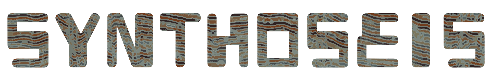

Generating seismic data and associated labels to train deep learning networks.

## Overview

Synthoseis is an open-source, Python-based tool used for generating pseudo-random seismic data, as described in [Synthetic seismic data for training deep learning networks](https://library.seg.org/doi/abs/10.1190/int-2021-0193.1).

The goal of synthoseis is to generate realistic seismic data for training a deep learning network to identify features of interest in field-acquired seismic data.
Such training data should be plentiful, cover a diverse range of subsurface scenarios and provide quality training labels.

## Documentation

Read our documentation: https://sede-open.github.io/synthoseis/datagenerator.html

## Installation

We provide an [environment.yml](environment.yml) to install the required packages for synthoseis.

## Resources

### Quick Start

Run a model with parameters provided in the example config file

```
conda activate synthoseis
python main.py --config config/example.json --num_runs 1 --run_id seismic_example
```

### Overview of workflow

```
Load user-parameters from config file
Build initial horizon at base and deposit layers of random thickness on top until some minimum depth is reached
Choose facies for each layer
Convert stack of horizons into a geologic age model
Generate faults and apply to age model
Identify closures using flood-filling algorithm
Fill closures randomly with fluids
Calculate elastic rock properties
Calculate reflection coefficients for each required incident angle
Apply random noise
Convolve using Butterworth bandpass filter to generate bandlimited seismic reflectivity
Apply geophysical augmentation (such as lateral smoothing, trace integration, amplitude balancing, RMO)
```

### User parameters

An example user-parameter json format file is provided in the config folder, and is used to set parameters for generating a batch of training data.

| Key                        | Description                                                                                                                                                                                             |
| -------------------------- | ------------------------------------------------------------------------------------------------------------------------------------------------------------------------------------------------------- |
| project                    | Name of project. Used to select the rock property model associated with the project                                                                                                                     |
| project_folder             | Output directory for models                                                                                                                                                                             |
| work_folder                | Temporary folder used for storing intermediate data. Deleted on model completion                                                                                                                        |
| cube_shape                 | Number of samples in [X, Y, Z] for output data                                                                                                                                                          |
| incident_angles            | Central angle for the output seismic angle-stacks                                                                                                                                                       |
| digi                       | Vertical sampling rate                                                                                                                                                                                  |
| infill_factor              | Initial oversampling multiplier in the Z direction. Due to memory contraints, this is only used to construct the initial, unfaulted horizons                                                            |
| initial_layer_stdev        | Standard deviation of the depth of initial horizon at the base of the model, random value is chosen between the provided [low, high] range                                                              |
| thickness_min              | Minimum thickness of layers (in samples)                                                                                                                                                                |
| thickness_max              | Maximum thixkness of layers (in samples)                                                                                                                                                                |
| seabed_min_depth           | Random thickness layers are "deposited" on top of previous layers. When a horizon's minimum depth is below this value, this becomes the top-most horizon, usually the seabed                            |
| signal_to_noise_ratio_db   | Signal to noise ratio in decibels to control the noise level of the output seismic data. A random value is chosen from a (trimmed) triangular distribution from the provided [left, mode, right] values |
| bandwidth_low              | Bandpass low-cut value is chosen at random between the [low, high] values provided                                                                                                                      |
| bandwidth_high             | Bandpass high-cut value is chosen at random between the [low, high] values provided                                                                                                                     |
| bandwidth_ord              | Order of the slope used in the bandpass filter                                                                                                                                                          |
| dip_factor_max             | A scaling factor applied to the dip of each layer                                                                                                                                                       |
| min_number_faults          | Minimum number of faults in the model                                                                                                                                                                   |
| max_number_faults          | Maximum number of faults in the model                                                                                                                                                                   |
| pad_samples                | Additional padding in Z-direction to avoid edge effects, given in samples                                                                                                                               |
| max_column_height          | Maximum vertical height of column in a 3D closure                                                                                                                                                       |
| closure_types              | Used to enable specific closure types, from "simple" (4-way), "faulted" (3-way), or "onlap" (stratigraphic)                                                                                             |
| min_closure_voxels_simple  | Oil or gas filled simple closures with fewer voxels than this threshold will be filled with brine                                                                                                       |
| min_closure_voxels_faulted | As min_closure_voxels_simple but for faulted closures                                                                                                                                                   |
| min_closure_voxels_onlap   | As min_closure_voxels_simple but for stratigraphic closures                                                                                                                                             |
| sand_layer_thickness       | Average thickness of stacked sand layers a priori, given in number of layers                                                                                                                            |
| sand_layer_fraction        | Average percentage of sand layers in model a priori                                                                                                                                                     |
| extra_qc_plots             | Switch to turn on/off additional QC output png plots                                                                                                                                                    |
| verbose                    | Switch to turn on/off verbosity                                                                                                                                                                         |
| partial_voxels             | If true, calculate an average property inside voxels that span multiple layers                                                                                                                          |
| variable_shale_ng          | If true, enable net to gross to vary laterally in shale layers, otherwise use a net to gross of 0                                                                                                       |
| basin_floor_fans           | Switch to turn on/off basin floor fan-shaped features in layers                                                                                                                                         |
| include_channels           | Switch to turn on/off channels (deprecated, always false)                                                                                                                                               |
| include_salt               | Switch to turn on/off salt bodies                                                                                                                                                                       |
| write_to_hdf               | Write QC and additional volumes to HDF file                                                                                                                                                             |
| broadband_qc_volume        | Output a bandpassed seismic data with a low-cut of 2Hz and high-cut of 90Hz to simulate broadband seismic                                                                                               |
| model_qc_volumes           | Save QC volumes to disk                                                                                                                                                                                 |
| multiprocess_bp            | Use multiprocessing to speed up the bandpass operations                                                                                                                                                 |

### Rock properties

An example rock property model is provided in [rpm_example.py](rockphysics/rpm_example.py), and consists of trends as functions of depth for Vp, Vs and Rho for shales and fluid-filled sands.

To add a new rock property model, use the `rpm_example.py` as a template to create a similar python script containing the new depth trends for each fluid/facies combination, for example `rockphysics/new_rpm.py`. Create a new config.json file and replace the `project` value to `"new_rpm"`.

## Examples Gallery

<!-- <details><summary>Geologic Age</summary> -->

### Geologic Age

<table>
<tr>
  <td>
  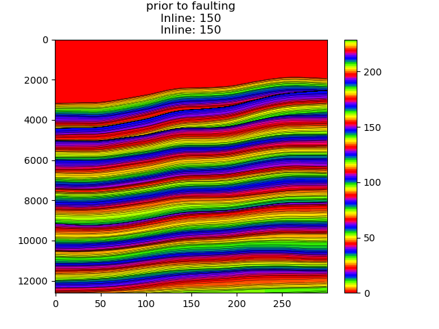
  </td>
  <td>
  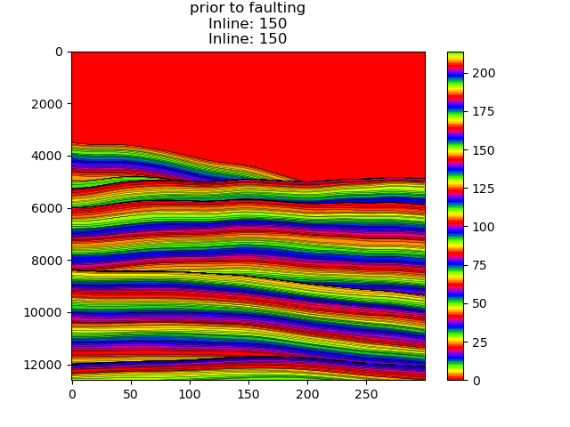
  </td>
  <td>
  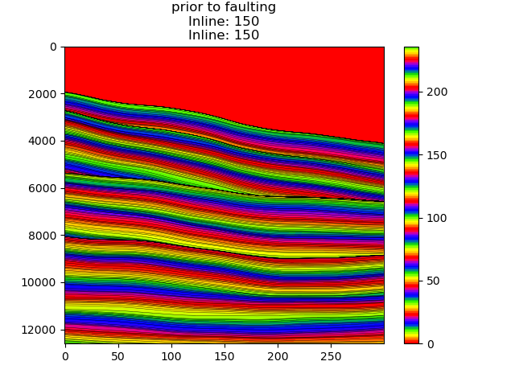
  </td>
</tr>
</table>
<!-- </details> -->

<!-- <details><summary>Basin Floor Fans</summary> -->

### Basin Floor Fans

<table>
<tr>
  <td>
  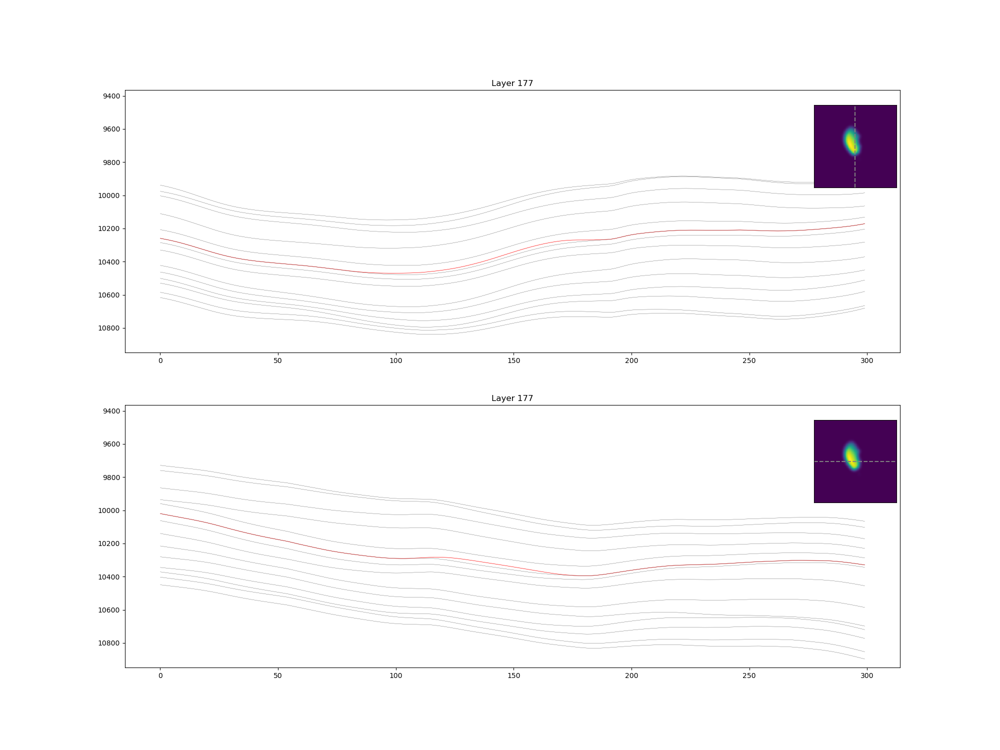
  </td>
  <td>
  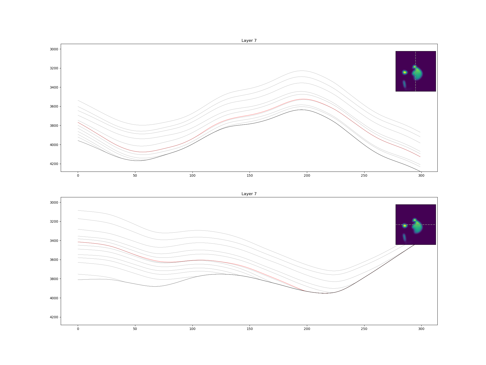
  </td>
  <td>
  
  </td>
</tr>
</table>
<!-- </details> -->

<!-- <details><summary>Salt bodies</summary> -->

### Salt Bodies

Cross-section through example salt bodies, coloured by lithology, where shale=0, sand=1, salt=2

<table>
<tr>
  <td>
  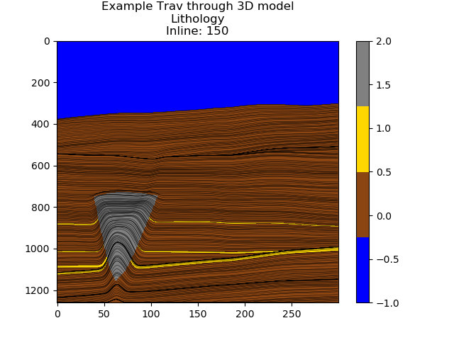
  </td>
  <td>
  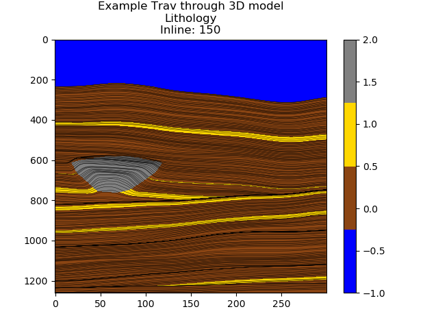
  </td>
  <td>
  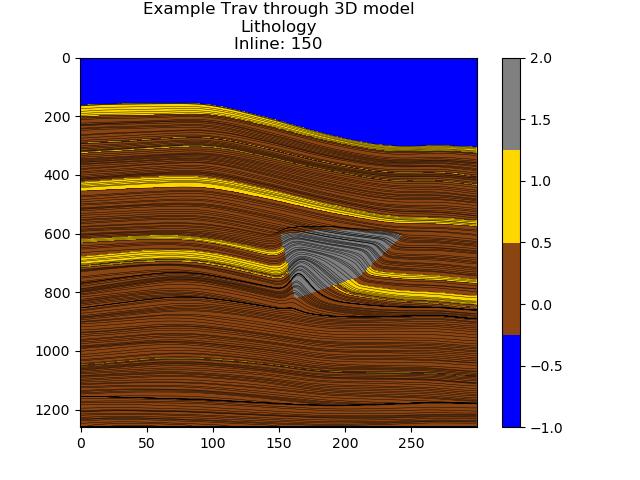
  </td>
</table>

<!-- <details><summary>Faulting Styles</summary> -->

### Faulting Styles

Faulting style is chosen from self branching, stair case, horst graben or relay ramp, as shown from left to right. Alternatively, faults can be entirely random (not shown).

<table><tr>
  <td>
  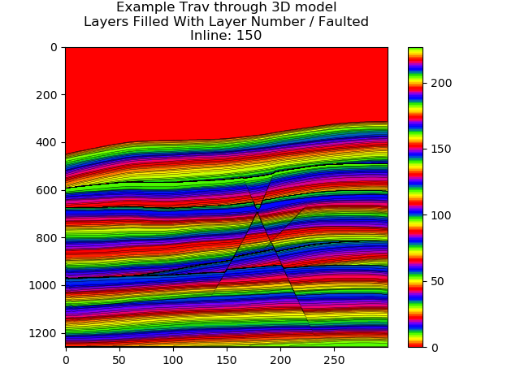
  </td>
  <td>
  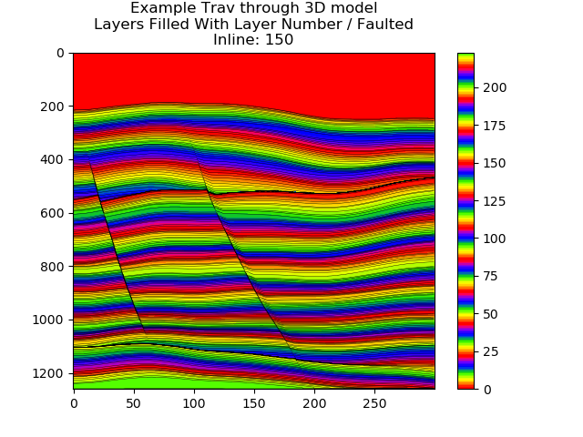
  </td>
  <td>
  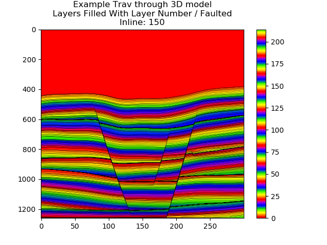
  </td>
  <td>
  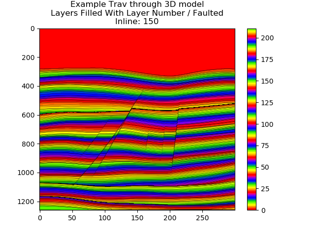
  </td>
</tr>
</table>
<!-- </details> -->

<!-- <details><summary>Closures</summary> -->

### Closures

Example closures, coloured by closure number

<table>
<tr>
  <td>
  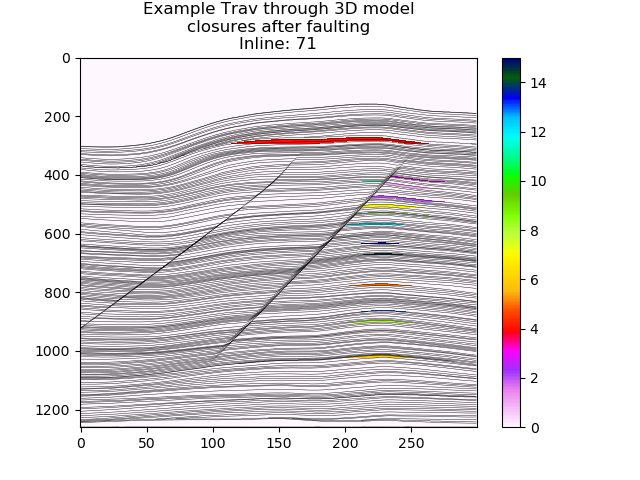
  </td>
  <td>
  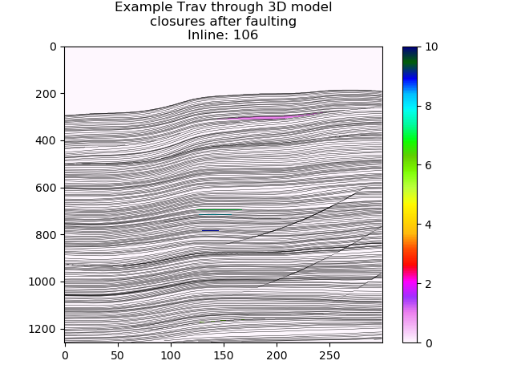
  </td>
  <td>
  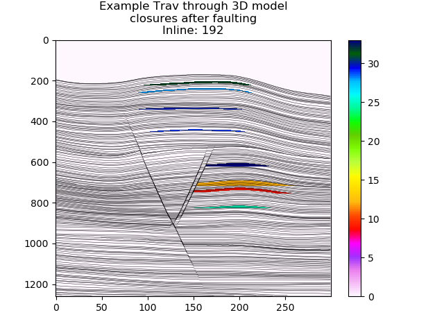
  </td>
</tr>
</table>
<!-- </details> -->

### Seismic Data

Cross-sections through the centre of some example models, showing the layered earth model coloured by facies on left, and fullstack RAI seismic data on the right.
Sand content for models is chosen using a Markov process, values a priori (input) and a posteriori (output) are shown in the facies plot.

<table>
<tr>
  <td>
  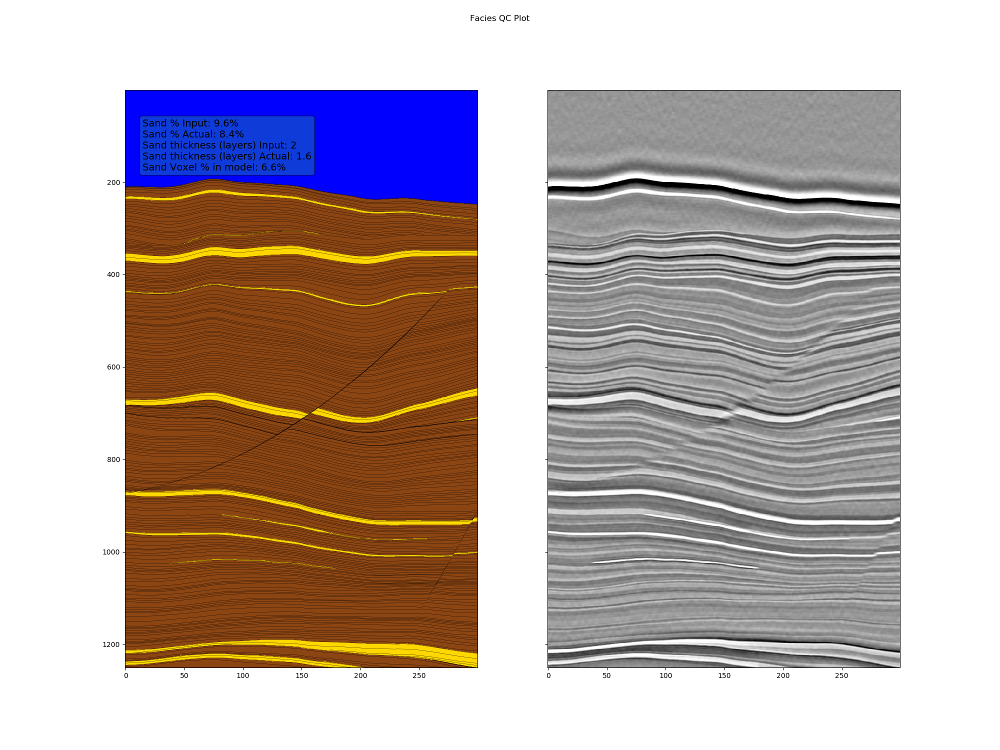
  </td>
  <td>
  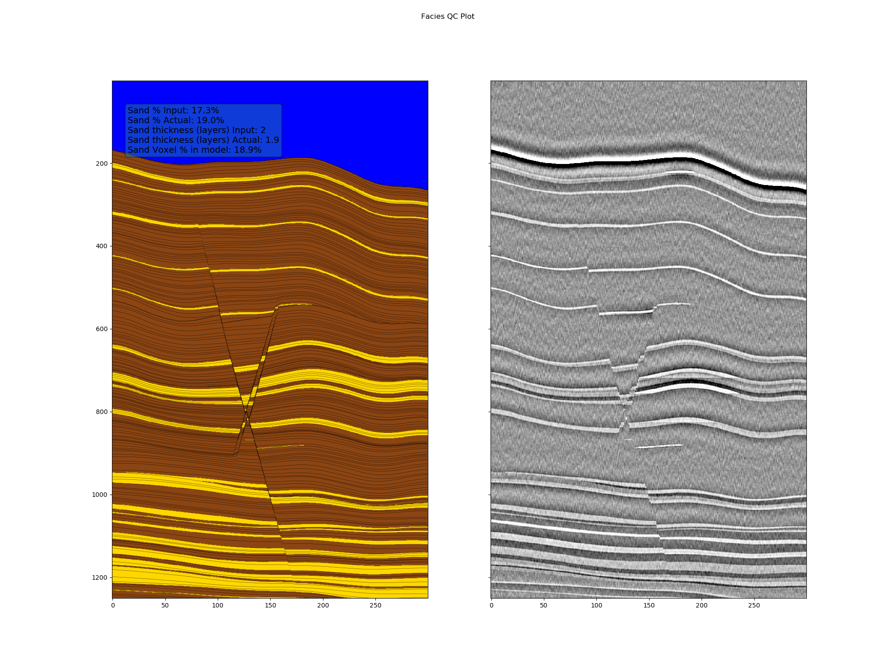
  </td>
  <td>
  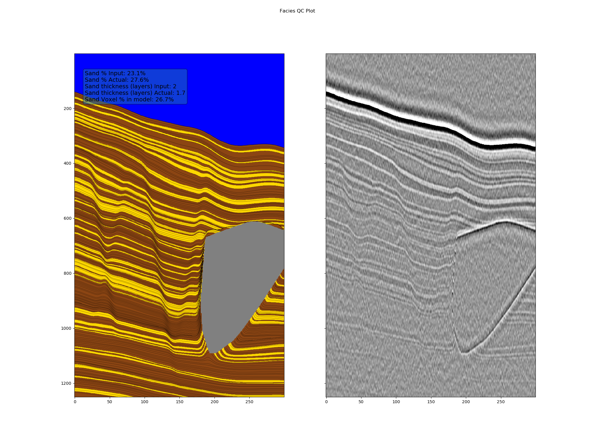
  </td>
</tr>
</table>

## Contributing

We welcome all kinds of contributions. The preferred way of submitting a contribution is to either make an issue on GitHub or by forking the project on GitHub and making a pull request.

## Citation

```
@article{doi:10.1190/INT-2021-0193.1,
author = {Tom P. Merrifield and Donald P. Griffith and S. Ahmad Zamanian and Stephane Gesbert and Satyakee Sen and Jorge De La Torre Guzman and R. David Potter and Henning Kuehl},
title = {Synthetic seismic data for training deep learning networks},
journal = {Interpretation},
volume = {10},
number = {3},
pages = {SE31-SE39},
year = {2022},
doi = {10.1190/INT-2021-0193.1},
```
